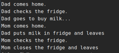

#### [설명]
세마포어를 이용해 동기화 문제를 해결하는 코드이다.
mom과 dad 프로그램은 fridge 파일을 이용해 서로 통신한다.
mom 또는 dad는 집에 도착해 냉장고를 열고 냉장고에 우유가 없다면 
우유를 사러 갔다 온 후 냉장고에 우유를 넣고 떠난다. 
만약 냉장고를 열었을때 우유가 있다면 냉장고를 닫고 떠난다.

#### [코드]

```c++
#include <unistd.h>
#include <stdio.h>
#include <fcntl.h>
#include <semaphore.h>
#include <sys/ipc.h>

int main(int argc, char** argv){
  int fd;
  int VALUE = 1;
  const int key = 1000;
  printf("Mom comes home.\n");
  sem_t *smid;
  if((smid = sem_open("mysem", O_CREAT, 0777,VALUE)) == NULL){
    perror("semopen");
	exit(-1);
  }
  char buf[] = "Milk";
  while(1){
  sem_wait(smid);
  printf("Mom checks the fridge.\n");

  fd = open("fridge", O_CREAT|O_RDWR|O_APPEND,0777);
  int fsize;
  if((fsize = lseek(fd, 0, SEEK_END)) == 0){
    printf("Mom goes to buy milk...\n");
    sleep(2);
    write(fd,buf, 5);
    printf("Mom puts milk in fridge and leaves\n");
  }else if(fsize >= 1){
    printf("Mom closes the fridge and leaves\n");
  }
   sem_post(smid);
   break;
  }
}

```
#### [결과]



지적 환영합니다.


